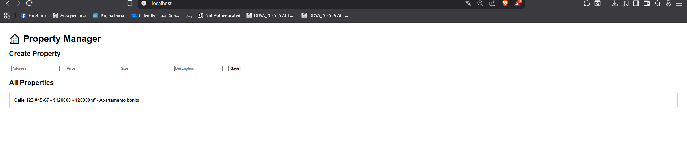

# Property Manager – CRUD System

##  Project Summary
This project is a simple **CRUD system** to manage real estate properties.  
It allows users to:

- Create new property listings.
- View all properties and details of each one.
- Update property information.
- Delete property listings.

The system is built with:
- **Frontend**: HTML + JavaScript (Fetch API) served by Nginx.
- **Backend**: Spring Boot REST API with JPA/Hibernate.
- **Database**: MySQL (Dockerized).

All services run in **Docker** and can be deployed to AWS on separate containers/servers.

---

##  System Architecture

```
[Frontend (Nginx + HTML/JS)]  →  [Backend (Spring Boot REST API)]  →  [Database (MySQL)]
```

- **Frontend**: Simple HTML/JS interface, sends requests via Fetch API to backend.  
- **Backend**: Exposes REST endpoints (`/api/properties`) to handle CRUD.  
- **Database**: Stores property data in MySQL using JPA for persistence.  

---

##  Class Design

### Main Components
- **Property.java** → Entity mapped to `properties` table.
- **PropertyRepository.java** → JPA repository for CRUD.
- **PropertyService.java** → Service layer, business logic.
- **PropertyController.java** → REST API controller.

### UML Diagram (simplified)

```
+-----------------+       +-----------------+       +-------------------+
|  Property       |<----->| Repository      |<----->| Service           |
|  id: Long       |       | JpaRepository   |       | +findAll()        |
|  address: String|       +-----------------+       | +findById()       |
|  price: Double  |                               | +save()           |
|  size: String   |                               | +delete()         |
|  description:Str|                               +-------------------+
+-----------------+
        |
        v
+-------------------+
| Controller        |
| /api/properties   |
+-------------------+
```

---

## ⚙Deployment Instructions

### 1. Clone Repository
```bash
git clone https://github.com/daviespr1406/Arep_Properties.git
cd Arep_Properties
```

### 2. Build Backend JAR
```bash
./mvnw clean package -DskipTests
```

The JAR will be inside `target/`.

### 3. Run with Docker Compose
```bash
docker-compose up --build
```

This will start:
- **MySQL** (port `3306`)
- **Spring Boot backend** (port `8080`)
- **Nginx frontend** (port `80`)

### 4. Access Application
- Frontend: [http://localhost](http://localhost)  
- Backend API: [http://localhost:8080/api/properties](http://localhost:8080/api/properties)  

---

##  Repository Structure


##  REST Endpoints

- `GET /api/properties` → list all properties  
- `GET /api/properties/{id}` → get one property  
- `POST /api/properties` → create new property  
- `PUT /api/properties/{id}` → update property  
- `DELETE /api/properties/{id}` → delete property  

Example `POST` body:

```json
{
  "address": "123 Main St",
  "price": 250000,
  "size": "120m²",
  "description": "Cozy family home"
}
```

---

## Screenshots

### Home



---

## 🎥 Deployment Video
A short video is included in `/docs/` showing:
- Docker containers running  
- Database updated in MySQL  

---


## 👨‍💻 Authors
Developed as part of **AREP – Escuela Colombiana de Ingeniería Julio Garavito**.
- David Santiago Espinosa
